# Target Anomalies Database Schema Diagrams

**Version:** 3.0  
**Date:** December 8, 2025  
**PostgreSQL Version:** 14.17  
**Schema:** iadbschema  
**System:** Sunshine IPR 2.0 - Target Anomaly Detection (TAD)

---

## Table of Contents

1. [Complete Entity Relationship Diagram](#1-complete-entity-relationship-diagram)
2. [Schema Organization](#2-schema-organization)
3. [Rule-Based System Schema](#3-rule-based-system-schema)
4. [Behavior-Based System Schema](#4-behavior-based-system-schema)
5. [Table Dependency Graph](#5-table-dependency-graph)
6. [Index and Constraint Diagram](#6-index-and-constraint-diagram)
7. [Data Flow Diagram](#7-data-flow-diagram)

---

## 1. Complete Entity Relationship Diagram

### Full Schema ERD

```mermaid
erDiagram
    %% ========================================
    %% SHARED TABLES (Core Target Management)
    %% ========================================
    
    tad_target_groups {
        INTEGER group_id PK "Primary Key"
        VARCHAR(255) name UK "Unique group name"
        TEXT description "Group description"
        TIMESTAMP created_at "Default: CURRENT_TIMESTAMP"
        TIMESTAMP updated_at "Default: CURRENT_TIMESTAMP"
        INTEGER training_days "Default: 7"
        BOOLEAN is_enabled "Default: true"
        VARCHAR(20) group_type "RULE or BEHAVIOR"
        VARCHAR(100) created_by "User who created"
        TEXT users "Comma-separated user list"
    }
    
    tad_targets {
        INTEGER target_id PK "Composite PK with group_id"
        INTEGER group_id "PK FK Composite PK, FK to groups"
        VARCHAR(100) mobile_number "Target phone number"
        TIMESTAMP created_at "Default: CURRENT_TIMESTAMP"
        VARCHAR(100) target_name "Default: 'A'"
    }
    
    %% ========================================
    %% RULE-BASED TABLES
    %% ========================================
    
    tad_rules {
        SERIAL rule_id PK "Auto-increment PK"
        VARCHAR(255) name "Rule name"
        TEXT description "Rule description"
        VARCHAR(50) rule_type "Type of rule"
        VARCHAR(50) data_source "Data source identifier"
        BOOLEAN is_enabled "Default: true"
        TEXT configurable_field "Nullable"
        TEXT sql_template "SQL query template"
        TIMESTAMP created_at "Default: now()"
        TIMESTAMP updated_at "Nullable"
        TEXT info "Additional info, nullable"
        VARCHAR(50) type "Default: 'predefined'"
    }
    
    tad_column_master {
        INTEGER field_id PK "Primary Key"
        VARCHAR(100) field_name "Unique field name"
        VARCHAR(100) display_name "UI display name"
        VARCHAR(50) field_type "Data type"
        VARCHAR(50) ui_component "UI component type"
        TEXT available_operators "Nullable"
        TEXT group_subfields "Nullable"
        TIMESTAMP created_at "Default: now()"
        TIMESTAMP updated_at "Nullable"
    }
    
    tad_rule_configuration {
        SERIAL configuration_id PK "Auto-increment PK"
        INTEGER rule_id FK "FK to tad_rules"
        INTEGER field_id FK "FK to tad_column_master"
        TEXT default_value "Nullable"
        BOOLEAN is_mandatory "Default: false"
        BOOLEAN is_editable "Default: true"
        TEXT selected_operator "Nullable"
        TIMESTAMP created_at "Default: now()"
        TIMESTAMP updated_at "Nullable"
        BOOLEAN is_operator_editable "Default: false"
    }
    
    tad_target_group_rules {
        INTEGER group_id "PK FK Composite PK, FK to groups"
        INTEGER rule_id "PK FK Composite PK, FK to rules"
        VARCHAR(255) name "Nullable"
        VARCHAR(255) unique_name PK "Composite PK"
        JSONB custom_params "Rule parameters"
        TIMESTAMP added_at "Default: CURRENT_TIMESTAMP"
        TIMESTAMP updated_at "Default: CURRENT_TIMESTAMP"
        JSONB helper_json "Helper data, nullable"
    }
    
    %% ========================================
    %% BEHAVIOR-BASED TABLES
    %% ========================================
    
    tad_insight {
        INTEGER insight_id PK "Primary Key"
        VARCHAR(100) insight_name UK "Unique insight name"
        VARCHAR(200) insight_display_name "Display name, nullable"
        TEXT description "Nullable"
        TIMESTAMP created_at "Default: CURRENT_TIMESTAMP"
        TIMESTAMP updated_at "Default: CURRENT_TIMESTAMP"
    }
    
    tad_dimensions {
        INTEGER dimension_id PK "Primary Key"
        VARCHAR(100) dimension_name UK "Unique dimension name"
        VARCHAR(200) dimension_display_name "Display name, nullable"
        TEXT description "Nullable"
        TIMESTAMP created_at "Default: CURRENT_TIMESTAMP"
        TIMESTAMP updated_at "Default: CURRENT_TIMESTAMP"
    }
    
    tad_criteria {
        INTEGER criteria_id PK "Primary Key"
        VARCHAR(100) criteria_name UK "Unique criteria name"
        VARCHAR(200) criteria_display_name "Display name, nullable"
        TEXT description "Nullable"
        TIMESTAMP created_at "Default: CURRENT_TIMESTAMP"
        TIMESTAMP updated_at "Default: CURRENT_TIMESTAMP"
    }
    
    tad_behaviors_mapping {
        INTEGER behavior_id PK "Primary Key"
        INTEGER insight_id FK "FK to tad_insight"
        INTEGER dimension_id FK "FK to tad_dimensions"
        INTEGER criteria_id FK "FK to tad_criteria"
        TEXT sql_template "SQL query template"
        VARCHAR(200) template_name "Nullable"
        TEXT description "Nullable"
        BOOLEAN is_active "Default: true"
        TIMESTAMP created_at "Default: CURRENT_TIMESTAMP"
        TIMESTAMP updated_at "Default: CURRENT_TIMESTAMP"
    }
    
    tad_target_group_behaviors {
        INTEGER group_id "PK FK Composite PK, FK to groups"
        INTEGER behavior_id "PK FK Composite PK, FK to behaviors"
        TIMESTAMP created_at "Default: CURRENT_TIMESTAMP"
        TIMESTAMP updated_at "Default: CURRENT_TIMESTAMP"
    }
    
    %% ========================================
    %% RELATIONSHIPS
    %% ========================================
    
    %% Shared Relationships
    tad_target_groups ||--o{ tad_targets : "contains (group_id)"
    tad_target_groups ||--o{ tad_target_group_rules : "has rules (group_id)"
    tad_target_groups ||--o{ tad_target_group_behaviors : "has behaviors (group_id)"
    
    %% Rule-Based Relationships
    tad_rules ||--o{ tad_rule_configuration : "configured by (rule_id)"
    tad_rules ||--o{ tad_target_group_rules : "assigned to groups (rule_id)"
    tad_column_master ||--o{ tad_rule_configuration : "defines fields (field_id)"
    
    %% Behavior-Based Relationships
    tad_insight ||--o{ tad_behaviors_mapping : "mapped to (insight_id)"
    tad_dimensions ||--o{ tad_behaviors_mapping : "mapped to (dimension_id)"
    tad_criteria ||--o{ tad_behaviors_mapping : "mapped to (criteria_id)"
    tad_behaviors_mapping ||--o{ tad_target_group_behaviors : "assigned to groups (behavior_id)"
```

---

## 2. Schema Organization

### Logical Schema Layers

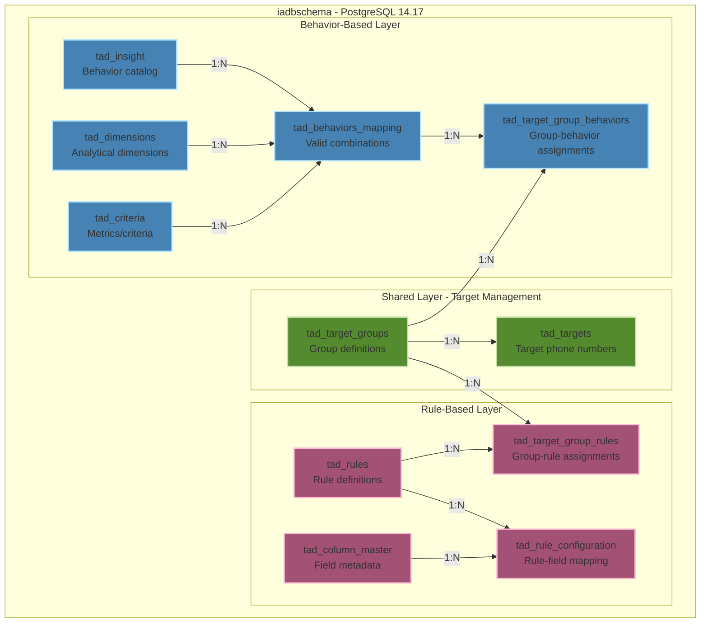

### Table Count by Category

| Category | Tables | Purpose |
|----------|--------|---------|
| **Shared** | 2 | Core target group and target management |
| **Rule-Based** | 4 | Rule definition, configuration, and assignment |
| **Behavior-Based** | 5 | Behavior catalog, mapping, and assignment |
| **Total** | **11** | Complete TAD system |

---

## 3. Rule-Based System Schema

### Rule System ERD (Detailed)

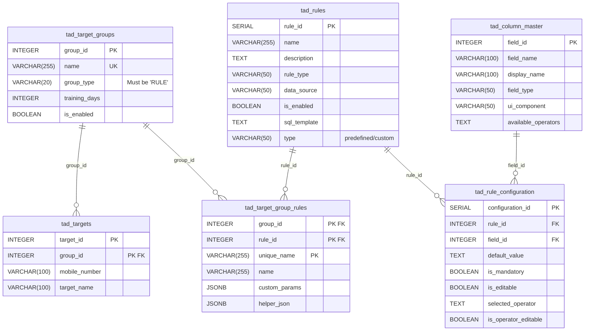

### Rule Configuration Flow

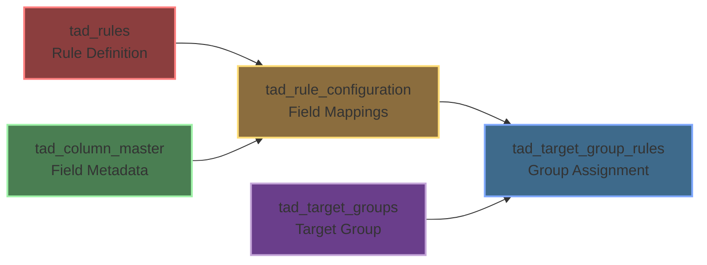

---

## 4. Behavior-Based System Schema

### Behavior System ERD (Detailed)

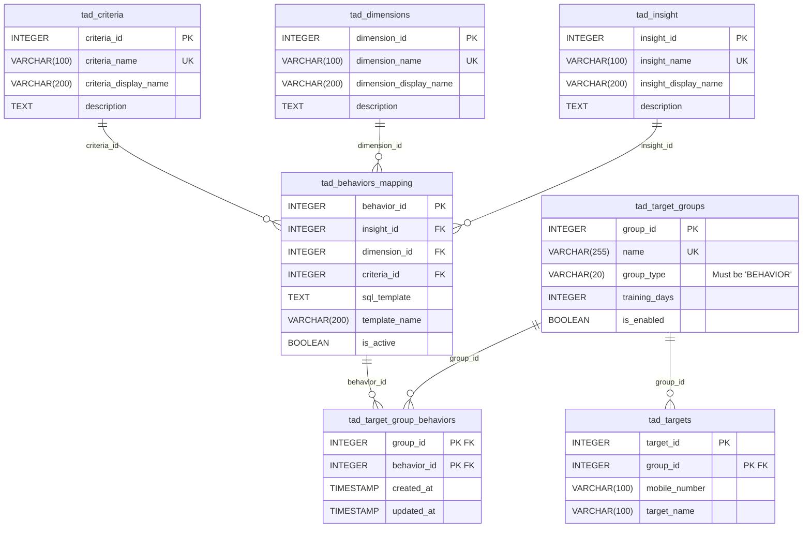

### Behavior Mapping Flow

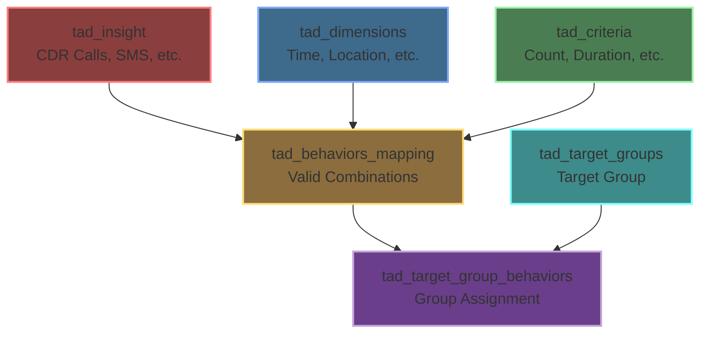

### Behavior Combination Matrix

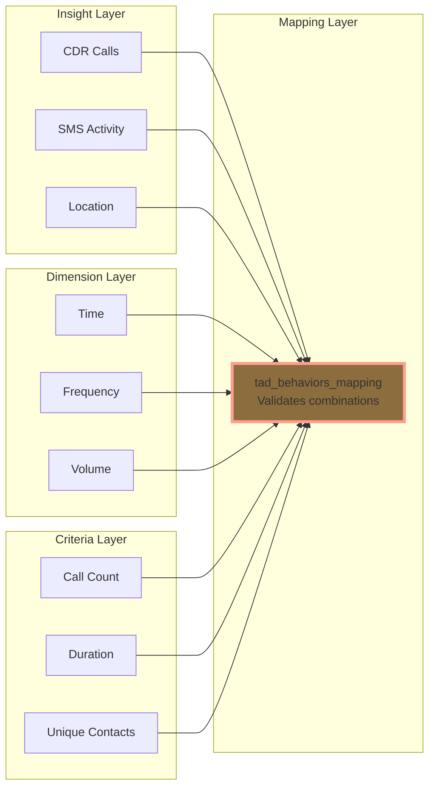

---

## 5. Table Dependency Graph

### Creation Order and Dependencies

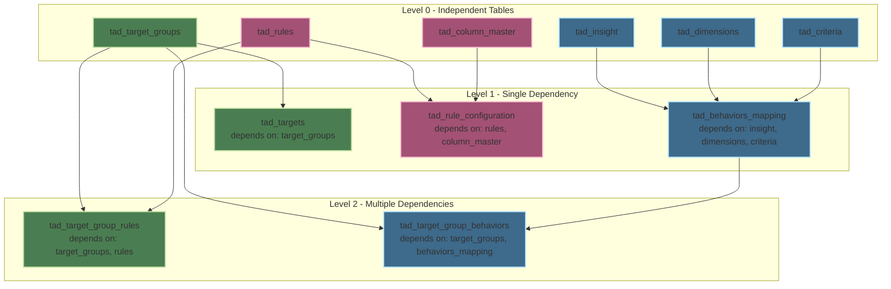

### Drop Order (Reverse Dependency)

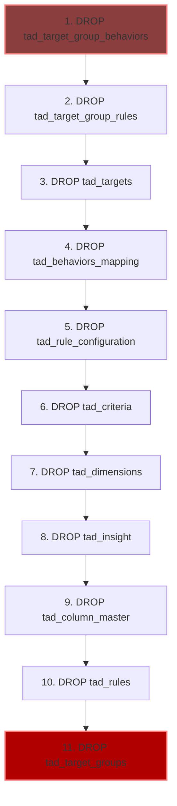

---

## 6. Index and Constraint Diagram

### Indexes Overview

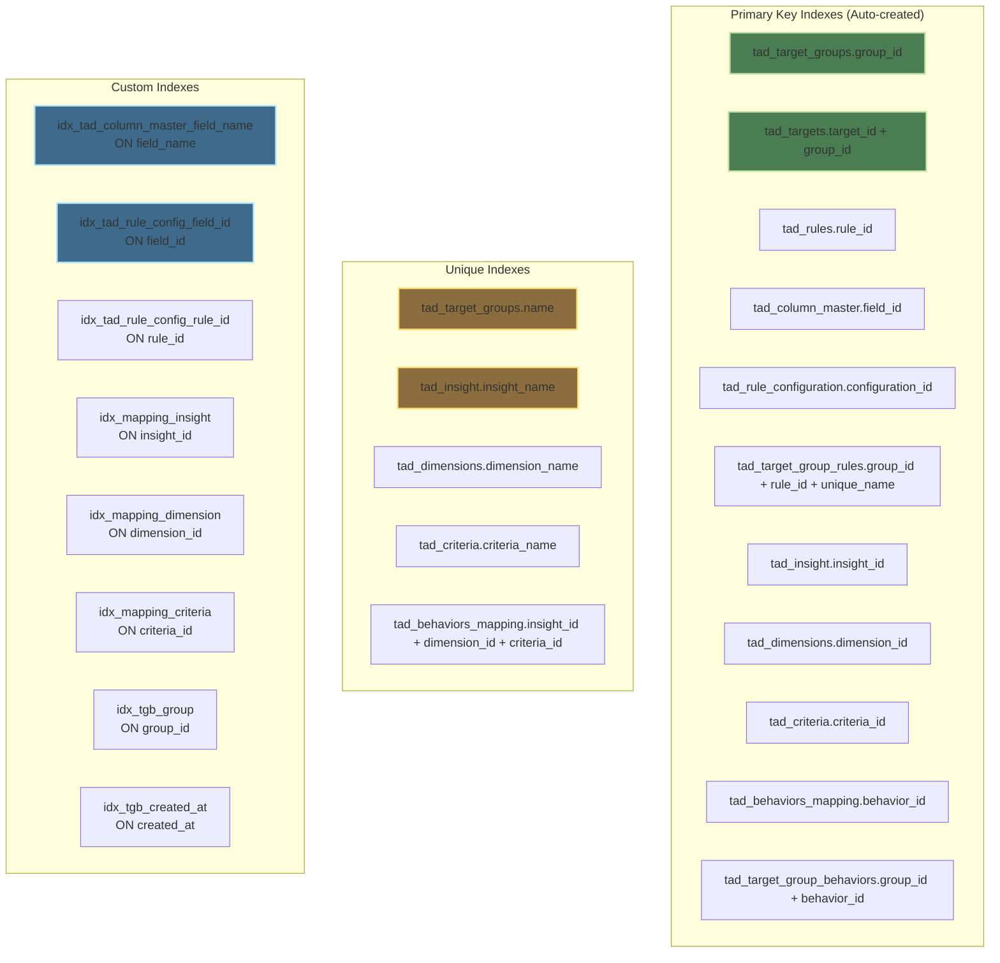

### Foreign Key Constraints

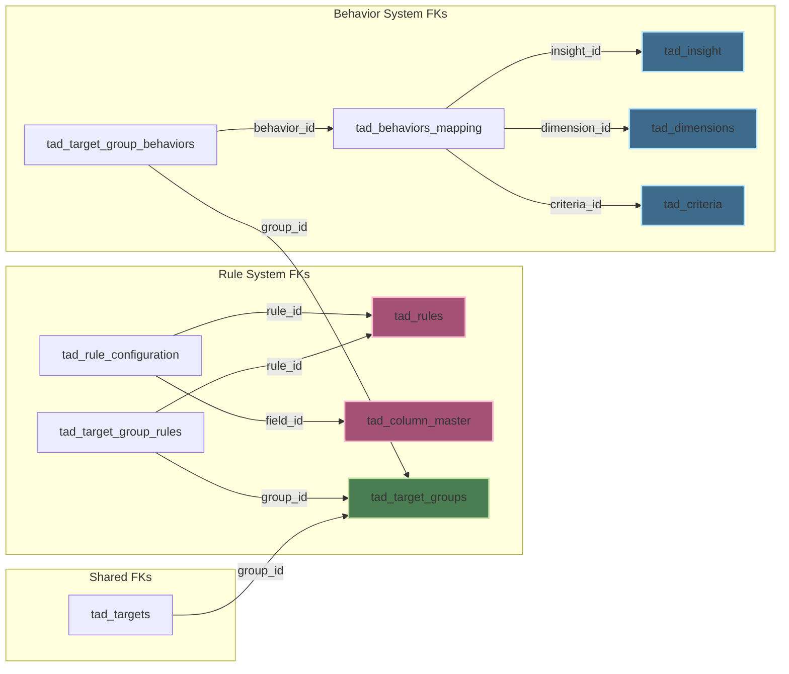

### Constraint Summary Table

| Table | Primary Key | Foreign Keys | Unique Constraints | Check Constraints |
|-------|-------------|--------------|-------------------|-------------------|
| **tad_target_groups** | group_id | - | name | - |
| **tad_targets** | target_id, group_id | group_id → tad_target_groups | - | - |
| **tad_rules** | rule_id | - | - | - |
| **tad_column_master** | field_id | - | - | - |
| **tad_rule_configuration** | configuration_id | rule_id → tad_rules field_id → tad_column_master | - | - |
| **tad_target_group_rules** | group_id, rule_id, unique_name | group_id → tad_target_groups rule_id → tad_rules | - | - |
| **tad_insight** | insight_id | - | insight_name | - |
| **tad_dimensions** | dimension_id | - | dimension_name | - |
| **tad_criteria** | criteria_id | - | criteria_name | - |
| **tad_behaviors_mapping** | behavior_id | insight_id → tad_insight dimension_id → tad_dimensions criteria_id → tad_criteria | insight_id + dimension_id + criteria_id | - |
| **tad_target_group_behaviors** | group_id, behavior_id | group_id → tad_target_groups behavior_id → tad_behaviors_mapping | - | - |

---

## 7. Data Flow Diagram

### Rule-Based Data Flow

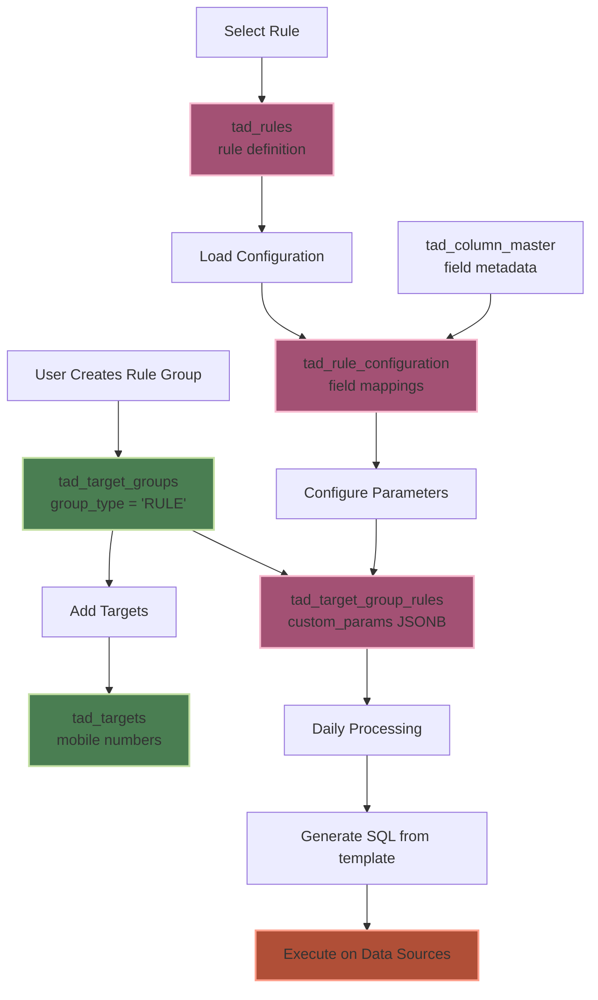

### Behavior-Based Data Flow

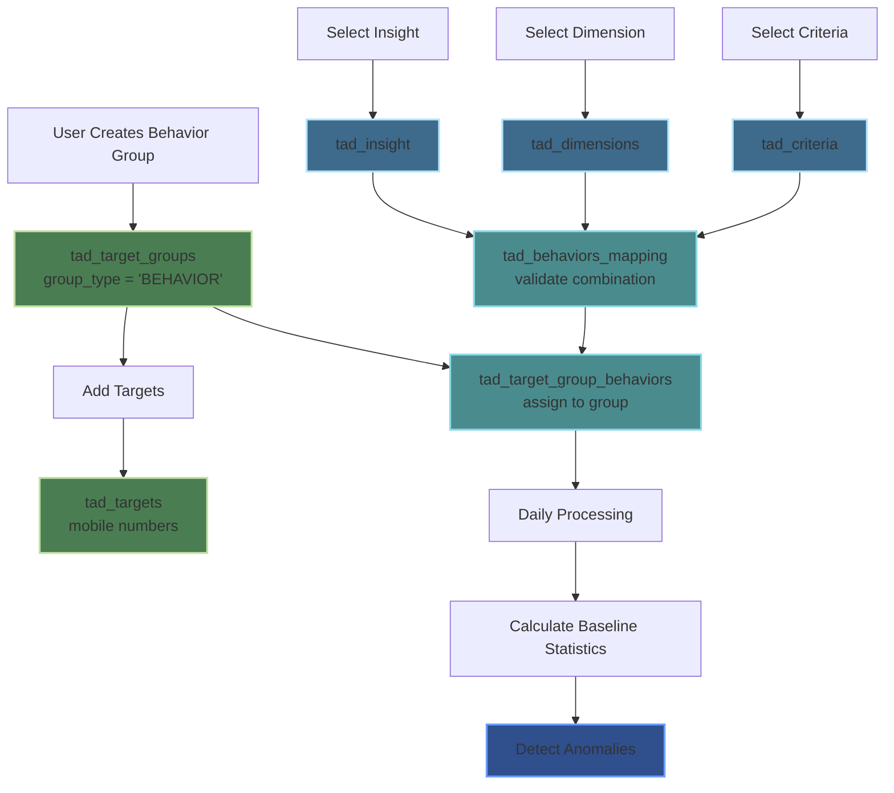

### Combined System Architecture

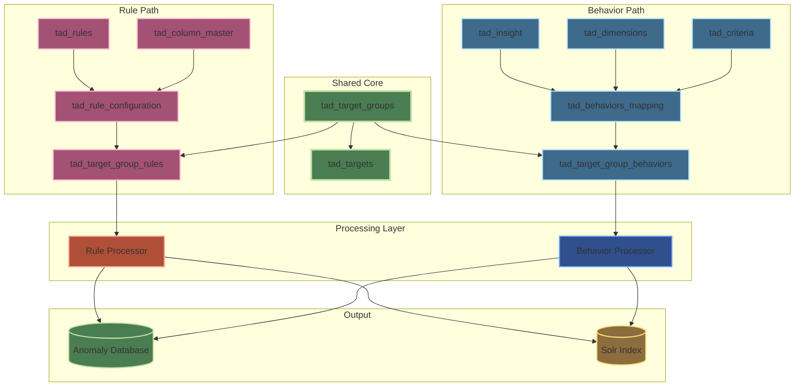

---

## Schema Statistics

### Table Size Estimates

| Table | Estimated Rows | Growth Rate | Notes |
|-------|---------------|-------------|-------|
| **tad_target_groups** | 100-500 | Low | One per investigation group |
| **tad_targets** | 1,000-10,000 | Medium | Multiple targets per group |
| **tad_rules** | 50-200 | Low | Predefined + custom rules |
| **tad_column_master** | 30-50 | Very Low | Field definitions |
| **tad_rule_configuration** | 200-1,000 | Low | Rule × Fields |
| **tad_target_group_rules** | 500-5,000 | Medium | Groups × Rules |
| **tad_insight** | 10-20 | Very Low | Behavior categories |
| **tad_dimensions** | 5-10 | Very Low | Analytical dimensions |
| **tad_criteria** | 15-30 | Very Low | Metrics |
| **tad_behaviors_mapping** | 50-200 | Low | Valid combinations |
| **tad_target_group_behaviors** | 200-2,000 | Medium | Groups × Behaviors |

### Sequence Information

| Sequence | Table | Column | Current Strategy |
|----------|-------|--------|------------------|
| **tad_rule_configuration_configuration_id_seq** | tad_rule_configuration | configuration_id | INCREMENT 1, START 1, CACHE 1 |
| **tad_rules_rule_id_seq** | tad_rules | rule_id | Auto-created by SERIAL |

---

## Color Legend

- 🟢 **Green** - Shared/Core tables
- 🔴 **Red/Pink** - Rule-based system tables
- 🔵 **Blue** - Behavior-based system tables
- 🟡 **Yellow** - Configuration/Metadata tables
- 🟣 **Purple** - Junction/Mapping tables

---

## Notes

1. **PostgreSQL Version**: Schema requires PostgreSQL 14.0 or higher
2. **Schema Name**: All tables reside in `iadbschema`
3. **Cascade Deletes**: 
   - `tad_target_group_rules` has `ON DELETE CASCADE` for `group_id`
   - `tad_behaviors_mapping` has `ON DELETE CASCADE` for all FKs
4. **JSONB Columns**: 
   - `tad_target_group_rules.custom_params` - Stores rule parameters
   - `tad_target_group_rules.helper_json` - Stores helper data
5. **Composite Primary Keys**:
   - `tad_targets`: (target_id, group_id)
   - `tad_target_group_rules`: (group_id, rule_id, unique_name)
   - `tad_target_group_behaviors`: (group_id, behavior_id)

---

**Document End**
